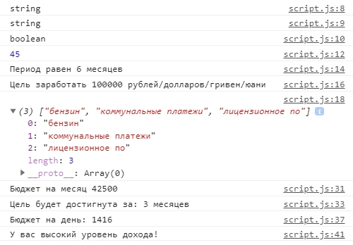

# GloAcademy
Публикация работ по заданиям с [Glo Academy](https://glo-academy.ru/)

## Урок №1. Введение в язык, подключение javascript. Основы работы с Git
:white_check_mark: [Материалы основного задания](https://github.com/Ckopn84/GloAcademy/tree/lesson01/lesson01)
> 1) Создать **HTML страницу** и подключить к ней **файл скрипта**
> 2) В файле скрипта **создать переменные**:
>   - money, 
>   - income, 
>   - addExpenses, 
>   - deposit, 
>   - mission, 
>   - period
> 3) Вывести на экран в модальном окне **(alert)** сообщение с любым текстом
> 4) Вывести **в консоль** сообщение с любым текстом
> 5) Проверить, чтобы все работало и **не было ошибок** в консоли
> 6) Создать свой _репозиторий на GitHub_ и поместить туда **папку с первым заданием**

:white_check_mark: [Материалы дополнительного задания](https://github.com/Ckopn84/GloAcademy/tree/lesson01)
> В репозитории создать **отдельную ветку lesson01** и в неё запушить основное задание

## Урок №2. Типы данных, операторы, методы и свойства
:white_check_mark: [Материалы основного задания](https://github.com/Ckopn84/GloAcademy/tree/lesson02/lesson02)
> 1) Следующим переменным **присвоить значения**
>   - **money** - любое **число** “Доход за месяц”,
>   - **income** - **строка** с дополнительными доходом (например: фриланс), 
>   - **addExpenses** - **строка** с перечислением дополнительных расходов через запятую (например: интернет, такси, коммуналка), 
>   - **deposit** - любое **булево значение**,
>   - **mission** - любое **число** (Какую сумму хотите накопить),
>   - **period** - **число** от 1 до 12 (месяцев)
> 2) Используя **методы и свойства**:
>   - Вывести в консоль **тип данных** значений переменных **money, income, deposit**;
>   - Вывести в консоль **длину строки addExpenses**
>   - Вывести в консоль **“Период равен (period) месяцев”** и “Цель заработать **(mission)** рублей/долларов/гривен/юани”
>   - Привести **строку** addExpenses **к нижнему регистру** и разбить строку на **массив**, вывести массив в консоль
>   - Объявить переменную **budgetDay** и **присвоить дневной бюджет** (доход за месяц / 30)
>   - Вывести в консоль **budgetDay**

:white_check_mark: [Материалы дополнительного задания](https://github.com/Ckopn84/GloAcademy/tree/hard/hard/lesson02)
> Необходимо выполнить в отдельном JS файле, подключенному к отдельной HTML странице
> 1) Создать переменную num со значением 266219 (тип данных число)
> 2) Вывести в консоль произведение (умножение) цифр этого числа
> 
> _Например_: число 123, при помощи javaScript получить каждое цифру ( 1, 2, 3 ) и перемножить их.
> 
> Правильно использовать цикл или методы перебора.
> 
> 3) Полученный результат возвести в степень 3, используя только 1 оператор (Math.pow не подходит)
> 4) Вывести на экран первые 2 цифры полученного числа

## Урок №3. Динамическая типизация данных в Javascript.Все об условиях
:white_check_mark: [Материалы основного задания](https://github.com/Ckopn84/GloAcademy/tree/lesson03/lesson03)
> 1) Весь функционал что был ранее оставляем, если что то необходимо удалить, об этом будет написано в задании
> 2) Спрашиваем у пользователя “Ваш месячный доход?” и результат сохраняем в переменную money
> 3) Спросить у пользователя “Перечислите возможные расходы за рассчитываемый период через запятую” сохранить в переменную addExpenses
> 4) Спросить у пользователя “Есть ли у вас депозит в банке?” и сохранить данные в переменной deposit (булево значение true/false)
> 5) Спросить у пользователя по 2 раза каждый вопрос и записать ответы в разные переменные 
>     1. “Введите обязательную статью расходов?” (например expenses1, expenses2)
>     1. “Во сколько это обойдется?” (например amount1, amount2) _в итоге 4 вопроса и 4 разные переменных_
> 6) Вычислить бюджет на месяц, учитывая обязательные расходы, сохранить в новую переменную budgetMonth и вывести результат в консоль
> 7) Зная budgetMonth, посчитать за сколько месяцев будет достигнута цель mission, вывести в консоль, округляя в большую сторону (методы объекта Math в помощь)
> 8) Поправить budgetDay учитывая бюджет на месяц, а не месячный доход. Вывести в консоль  округлив в меньшую сторону 
> 9) Написать конструкцию условий (расчеты приведены в рублях)	
>    1. Если budgetDay больше 1200, то “У вас высокий уровень дохода”
>    1. Если budgetDay больше 600 и меньше 1200, то сообщение “У вас средний уровень дохода”
>    1. Если budgetDay меньше 600 то в консоль вывести сообщение “К сожалению у вас уровень дохода ниже среднего”
>    1. Если отрицательное значение то вывести “Что то пошло не так”
>    1. Учесть варианты 0, 600 и 1200
> 10) Проверить, чтобы все работало и не было ошибок в консоли
> 11) Добавить папку с третьим уроком в свой репозиторий на GitHub
> 
> Примерный результат в консоли:
> 
> 

:white_check_mark: [Материалы дополнительного задания](https://github.com/Ckopn84/GloAcademy/tree/hard/hard/lesson03)
> Переменная lang может принимать 2 значения: 'ru' 'en'.
> Написать условия при котором в зависимости от значения lang будут выводится дни недели на русском или английском языке. Решите задачу
>    1. через if, 
>    1. через switch-case 
>    1. через многомерный массив без ифов и switch.
> У нас есть переменная namePerson. Если значение этой переменной “Артем” то вывести в консоль “директор”, если значение “Максим” то вывести в консоль “преподаватель”, с любым другим значением вывести в консоль “студент”
> _Решить задачу с помощью нескольких тернарных операторов, без использования if или switch_

## Урок №4. Все о функциях, callback - функции
:white_check_mark: [Материалы основного задания](https://github.com/Ckopn84/GloAcademy/tree/lesson04/lesson04)

:white_check_mark: [Материалы дополнительного задания](https://github.com/Ckopn84/GloAcademy/tree/hard/hard/lesson04)

## Урок №5. Все о циклах
:white_check_mark: [Материалы основного задания](https://github.com/Ckopn84/GloAcademy/tree/lesson05/lesson05)

:white_check_mark: [Материалы дополнительного задания](https://github.com/Ckopn84/GloAcademy/tree/hard/hard/lesson05)

## Урок №6. Функции, область видимости и замыкание
:white_check_mark: [Материалы основного задания](https://github.com/Ckopn84/GloAcademy/tree/lesson06/lesson06)

:white_check_mark: [Материалы дополнительного задания](https://github.com/Ckopn84/GloAcademy/tree/hard/hard/lesson06)

## Урок №7. Знакомимся с объектами и массивами, методы переборов и псевдомассивы
:white_check_mark: [Материалы основного задания](https://github.com/Ckopn84/GloAcademy/tree/lesson7/lesson07)

:white_check_mark: [Материалы дополнительного задания](https://github.com/Ckopn84/GloAcademy/tree/hard/hard/lesson07)

## Урок №8. Подготовим наш проект для работы со страницей
:white_check_mark: [Материалы основного задания](https://github.com/Ckopn84/GloAcademy/tree/lesson08/lesson08)

## Урок №9. Доступ к элементам на странице. DOM, BOM
:white_check_mark: [Материалы основного задания](https://github.com/Ckopn84/GloAcademy/tree/lesson09/lesson09)

:white_check_mark: [Материалы дополнительного задания](https://github.com/Ckopn84/GloAcademy/tree/hard/hard/lesson09)

## Урок №10. Отладка кода в Dev tools
:white_check_mark: [Материалы основного задания](https://github.com/Ckopn84/GloAcademy/tree/lesson10/lesson10)

:white_check_mark: [Материалы дополнительного задания](https://github.com/Ckopn84/GloAcademy/tree/hard/hard/lesson10) | 
:white_check_mark: [Материалы дополнительного задания на codepen.io](https://codepen.io/ckopn84/pen/vYOBVjw)

## Урок №11. Загрузка документа. События в JS. Обработчики событий и особенности их работы.
:white_check_mark: [Материалы основного задания](https://github.com/Ckopn84/GloAcademy/tree/lesson11/lesson11)

:white_check_mark: [Материалы дополнительного задания](https://github.com/Ckopn84/GloAcademy/tree/hard/hard/lesson11)

## Бонусное задание. Бонусное задание, события и DOM
:white_check_mark: [Бонусное задание](https://github.com/Ckopn84/GloAcademy/tree/hard/hard/lesson11bonus)

## Урок №12. Контекст вызова - this
:white_check_mark: [Материалы основного задания](https://github.com/Ckopn84/GloAcademy/tree/lesson12/lesson12)

## Урок №13. localStorage, sessionStorage, cookie
:white_check_mark: [Материалы основного задания](https://github.com/Ckopn84/GloAcademy/tree/lesson13/lesson13)

## Урок №14. ООП - Наследование, прототипы, конструкторы и классы
:white_check_mark: [Материалы основного задания](https://github.com/Ckopn84/GloAcademy/tree/lesson14/lesson14) | 
:white_check_mark: [Материалы основного задания # 2](https://github.com/Ckopn84/GloAcademy/tree/lesson14_2/lesson14_2)

:white_check_mark: [Материалы дополнительного задания](https://github.com/Ckopn84/GloAcademy/tree/hard/hard/lesson14)

## Урок №15. Особенности современного стандарта ES6 Шаблонные строки,интерполяция, Стрелочные функции, Геттеры, Сеттеры и Классы
:white_check_mark: [Материалы основного задания](https://github.com/Ckopn84/GloAcademy/tree/lesson15/lesson15)

:white_check_mark: [Материалы дополнительного задания](https://github.com/Ckopn84/GloAcademy/tree/hard/hard/lesson15)

## Урок №16. Доп урок ES6+
:white_check_mark: [Материалы основного задания](https://github.com/Ckopn84/GloAcademy/tree/lesson16/lesson16) | 
:white_check_mark: [Материалы основного задания # 2](https://github.com/Ckopn84/GloAcademy/tree/lesson16_2/lesson16_2)

:black_square_button: [Материалы дополнительного задания](https://github.com/Ckopn84/GloAcademy/tree/hard/hard/lesson16)

## Бонус урок. Способы перебора массива
:white_check_mark: [НЕОБЯЗАТЕЛЬНОЕ ЗАДАНИЕ](https://codepen.io/ckopn84/pen/dyoMBBm)

## Бонусное задание. Дополнительная практика
:white_check_mark: [Задача №1](https://codepen.io/ckopn84/pen/wvaWwgd)

:white_check_mark: [Задача №2](https://codepen.io/ckopn84/pen/wvaWwbm)

:white_check_mark: [Задача №3](https://codepen.io/ckopn84/pen/LYVZYYZ)

## Урок №17. Скрипты и время выполнения
:white_check_mark: [Материалы основного задания](https://github.com/Ckopn84/GloAcademy/tree/Lesson17/lesson17) | 
:white_check_mark: [Материалы основного задания п.6](https://github.com/Ckopn84/GloAcademy/tree/Lesson17/lesson17p6)

:white_check_mark: [Материалы дополнительного задания п.1](https://github.com/Ckopn84/GloAcademy/tree/hard/hard/lesson17p1) | 
:white_check_mark: [Материалы дополнительного задания п.2](https://github.com/Ckopn84/GloAcademy/tree/hard/hard/lesson17p2)

## Бонусное задание. Задание setTimeout
:white_check_mark: [Решение по бонусному заданию](https://codepen.io/ckopn84/pen/eYNzxzM)

## Урок №18. Параметры документа, окна и работа с ними
:white_check_mark: [Материалы основного задания](https://github.com/Ckopn84/GloAcademy/tree/lesson18/lesson18)

:white_check_mark: [Материалы дополнительного задания](https://github.com/Ckopn84/GloAcademy/tree/hard/hard/lesson18)

## Урок №19. Делегирование
:white_check_mark: [Материалы основного задания](https://github.com/Ckopn84/GloAcademy/tree/lesson19/lesson19)

:white_check_mark: [Материалы дополнительного задания](https://github.com/Ckopn84/GloAcademy/tree/hard/hard/lesson19)

## Урок №20. Пишем слайдер с помощью делегирования
:white_check_mark: [Материалы основного задания](https://github.com/Ckopn84/GloAcademy/tree/lesson20/lesson20)

:white_check_mark: [Материалы дополнительного задания](https://github.com/Ckopn84/GloAcademy/tree/hard/hard/lesson20)

## Урок №21. Работа с атрибутами. Дата Атрибуты Регулярные Выражения
:white_check_mark: [Материалы основного задания](https://github.com/Ckopn84/GloAcademy/tree/lesson21/lesson21)

:white_check_mark: [Материалы дополнительного задания](https://github.com/Ckopn84/GloAcademy/tree/hard/hard/lesson21) | 
:white_check_mark: [Codepen](https://codepen.io/ckopn84/pen/oNXZJmB)

## Урок №22. Пишем калькулятор
:white_check_mark: [Материалы основного задания](https://github.com/Ckopn84/GloAcademy/tree/lesson22/lesson22)

:white_check_mark: [Материалы дополнительного задания](https://github.com/Ckopn84/GloAcademy/tree/hard/hard/lesson22)

## Урок №23. Работа с формами и валидация
:white_check_mark: [Материалы основного задания](https://github.com/Ckopn84/GloAcademy/tree/lesson23/lesson23)

:white_check_mark: [Материалы практики](https://github.com/Ckopn84/GloAcademy/tree/lesson23/lesson23practice)

## Урок №24. Работа с JSON, AJAX. Получение и отправка данных на сервер
:white_check_mark: [Материалы основного задания](https://github.com/Ckopn84/GloAcademy/tree/lesson24/lesson24)

:white_check_mark: [Материалы дополнительного задания](https://github.com/Ckopn84/GloAcademy/tree/hard/hard/lesson24)

## КОНКУРС ЛУЧШИХ РАБОТ
:white_check_mark: [Материалы основного задания](https://github.com/Ckopn84/GloAcademy/tree/competitionForBestWork/competitionForBestWork)

## Урок №25. Асинхронный JavaScript, Promise
:white_check_mark: [Материалы практики](https://github.com/Ckopn84/GloAcademy/tree/lesson25practice/lesson25practice)

:white_check_mark: [Материалы основного задания](https://github.com/Ckopn84/GloAcademy/tree/lesson25/lesson25)

:white_check_mark: [Материалы дополнительного задания](https://github.com/Ckopn84/GloAcademy/tree/hard/hard/lesson25)

## Урок №26. Fetch
:white_check_mark: [Материалы основного задания](https://github.com/Ckopn84/GloAcademy/tree/lesson26/lesson26)

:white_check_mark: [Материалы дополнительного задания](https://github.com/Ckopn84/GloAcademy/tree/hard/hard/lesson26)

## Урок №27.Приём модуль. Webpack. Babel. Полифилы
[Материалы основного задания](https://github.com/Ckopn84/GloAcademy/tree/lesson27/lesson27)

[Материалы дополнительного задания](https://github.com/Ckopn84/GloAcademy/tree/hard/hard/lesson27)

